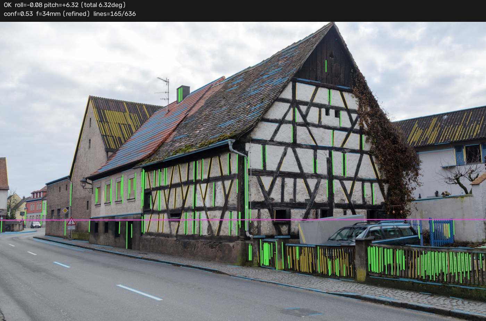
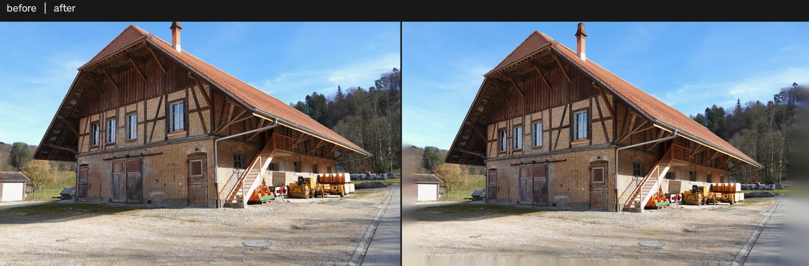

# Batch Perspective Correction

Straightens converging verticals in architectural photographs, a folder at a
time. Built for the case where most of a batch needs a small correction, some
needs none, and a few must not be touched at all -- so the default behaviour
when the geometry is unclear is to **leave the photograph alone** and offer it
for manual review.

Descended from [chsasank/Image-Rectification](https://github.com/chsasank/Image-Rectification),
rewritten after measuring what that code actually does
([docs/reference-review.md](docs/reference-review.md)). Design informed by
darktable's `ashift` and ShiftN ([docs/prior-art.md](docs/prior-art.md)); no code
taken from either.

## Install

    pip install -r requirements.txt

Python 3.9+. numpy, OpenCV, Pillow, piexif. The GUI additionally needs Tkinter,
which ships with the python.org Windows installer (`apt install python3-tk` on
Debian/Ubuntu). The CLI works without it.

## Use

    python rectify.py "D:\Fotos"                     write Foto_corr.jpg beside each original
    python rectify.py "D:\Fotos" -o "D:\Fertig" -r   to another folder, with subfolders
    python rectify.py "D:\Fotos" --overwrite         replace the originals (asks first)
    python rectify.py "D:\Fotos" -n -v               decide, write nothing, explain
    python rectify.py --gui                          graphical batch window

or double-click `run_gui.bat` on Windows.

Log lines are one per file:

    OK      DSC_0142.jpg  roll=-1.83deg pitch=+6.41deg conf=0.88 f=24mm(exif) keeps 87% 3648x2432 0.71s
    SKIPPED DSC_0143.jpg  already upright (0.09deg < 0.15deg)
    SKIPPED DSC_0144.jpg  low confidence (conf=0.21 < 0.40)
    ERROR   DSC_0145.jpg  cannot read (broken data stream)

### Options worth knowing

| flag | what it does |
|---|---|
| `--focal-35mm 24` | the exact lens, if you know it. **The single biggest accuracy win** |
| `--strength 0.7` | correct only part of the way |
| `--max-pitch`, `--max-roll` | caps in degrees (20 / 12) |
| `--min-confidence` | raise to skip more, lower to correct more |
| `--no-pitch` / `--no-roll` | level only, or straighten verticals only |
| `--crop aspect\|inside\|none` | keep the original aspect ratio, fit inside, or don't crop |
| `--detector hybrid` | combine LSD's precision with M-LSD's judgement. Needs `pip install ai-edge-litert` ([measurements](docs/detectors.md)) |
| `--mask auto` | ignore lines in vegetation and sky. **Pair it with `--focal-35mm`** ([why](docs/masking.md)) |
| `--sam-info` | which backends this Python has, and whether a checkpoint loads |
| `--sam-export DIR` | run SAM once from the Python that has torch; use the folder anywhere afterwards |
| `--mask sam --sam-model PATH` | Segment Anything decides what is clutter; SAM supplies the boundaries, the line detector the labels ([details](docs/masking.md)) |
| `--mask file --mask-file DIR` | one PNG mask per photo from any other tool |
| `--debug-dir DIR` | write line/horizon overlays and before-after pairs |
| `--json-report FILE` | machine-readable results |
| `-j 8` | parallel workers |

`python rectify.py --help` lists all of them.

## What it sees

Green: vertical lines the fit used. Yellow: vertical candidates the fit
rejected -- here the scattered clutter, on a real building usually the roof
rafters. Blue: horizontal lines. Magenta: the horizon implied by the fitted
model, which is derived from the vertical vanishing point rather than detected
separately. `--debug-dir` writes one of these per image.

## Graphical mode

Drop photos or a folder onto the window -- a **single image** is fine, so is a
mixed selection -- or click the drop area to browse. Drag and drop needs
`pip install tkinterdnd2`; without it the same area is a click target and says
so. Everything dropped appears in a list; **select one and press "review
selected image..."** (or double-click it) to open the review window without a
batch run first.

The batch window runs the selection and colour-codes every result. Double-click any
row -- especially a SKIPPED one -- to open manual review:

* **before and after, side by side**, updating live;
* **sliders** for roll, pitch and focal length;
* **click any detected line to strike it out**, and the fit is recomputed
  without it. One button strikes out everything leaning more than 18 deg, which
  is usually the roof;
* **save correction** or **keep original**;
* a **region mask** panel: switch between `off`, `auto` and a folder of masks
  from an external segmenter such as SAM, with an **opacity slider**, and see
  the excluded area and the lines it removed straight away. A mask you cannot
  see is a mask you cannot trust.

So an image the automatic pass declines is not lost -- it is queued for a
decision a person makes in a couple of seconds.

## Accuracy

Measured on 40 rendered scenes with an exactly known camera pose
([docs/accuracy.md](docs/accuracy.md)):

| | pitch | roll |
|---|---|---|
| focal length known | mean **0.10 deg**, worst 0.61 deg | mean 0.018 deg |
| focal length unknown (stripped web JPEG) | mean 2.03 deg, worst 5.41 deg | mean **0.017 deg** |

Levelling is accurate regardless, because roll does not depend on the focal
length. Correcting converging verticals does, so supplying `--focal-35mm` for a
folder shot with one lens turns the second row into the first.

## Tests

    python tests/run_tests.py           # 59 tests, no pytest needed
    python tests/run_tests.py -v

Drop real photographs into `tests/assets` and six further tests start running
against them; see `tests/assets/README.md` for the naming conventions.

## Licence

MIT. See LICENSE for the prior-art notes.
