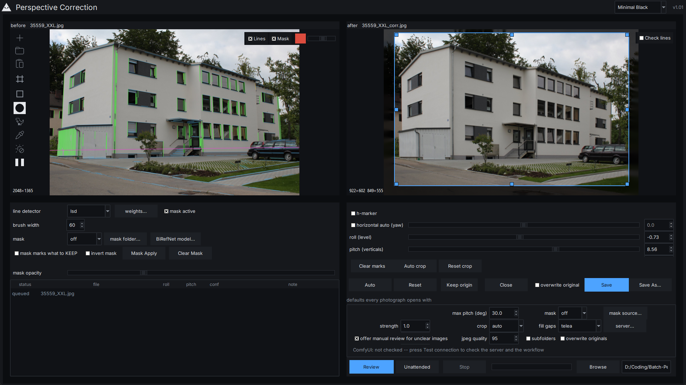

# Perspective Correction

Straightens converging verticals in architectural photographs — roll, pitch and
focal length, three numbers, `H = K R K⁻¹`. A camera rotation, so it cannot
shear the frame into something the lens never saw.

**Built around reviewing each photograph, not around processing a folder
unattended.** You step through a selection one image at a time, see what the
detector found, adjust it, and nothing is written until you press Save. A
fire-and-forget run over a folder is still there, one button along, but it is no
longer the default gesture: when a person is looking at every result, refusing a
correction costs more than attempting one.

Left, the original with what the estimator sees — green verticals it used,
yellow ones it rejected, blue horizontals, and the magenta horizon implied by the
fit. Right, the result, with grey guides you drag out of the black cross and lay
against an edge: a true vertical should run parallel to one. The tools that
change either sit on the picture they act on.

*(`docs/ui.png` predates the guides and still shows the retired measuring grid;
it wants re-taking.)*

Descended from [chsasank/Image-Rectification](https://github.com/chsasank/Image-Rectification),
rewritten after measuring what that code actually does
([docs/reference-review.md](docs/reference-review.md)). Design informed by
darktable's `ashift` and ShiftN ([docs/prior-art.md](docs/prior-art.md)); no code
taken from either.

## Install

    pip install -r requirements.txt        run it from this folder
    pip install -e .                       or install it, and get the `pc` command

Python 3.9+. numpy, OpenCV, Pillow, piexif -- and nothing else. The GUI
additionally needs Tkinter, which ships with the python.org Windows installer
(`apt install python3-tk` on Debian/Ubuntu). The CLI works without it.

Everything beyond that is optional, imported lazily, and reports what is missing
instead of failing at import. **`python rectify.py --doctor` says what is
present** before any file is touched:

    pip install -e ".[gui]"        drag-and-drop onto the batch window
    pip install -e ".[mlsd]"       the M-LSD detector (the model is vendored)
    pip install -e ".[deeplsd]"    the DeepLSD detector (also wants a checkout and 98 MB of weights)

### Model weights (not in this repository)

The optional segmentation backends need weights that are several gigabytes in
total, with single files over GitHub's 100 MB limit, so they are **not**
committed — the same reasoning that keeps `tools/DeepLSD/` out. Download them
yourself and put them where the code looks:

| what | where it goes | download |
|---|---|---|
| BiRefNet (general) | `models/BiRefNet/` | [ZhengPeng7/BiRefNet](https://huggingface.co/ZhengPeng7/BiRefNet) |
| BiRefNet HR — used by `--mask birefnet` here | `models/BiRefNet/` | [ZhengPeng7/BiRefNet_HR](https://huggingface.co/ZhengPeng7/BiRefNet_HR) |
| Grounding DINO — the box finder behind `--mask gdino` | `models/GroundingDINO/` | [IDEA-Research/GroundingDINO](https://github.com/IDEA-Research/GroundingDINO) (the `transformers` build: a folder with `config.json` + `.safetensors`) |
| SAM 2.1 | `models/sam2/` | [facebookresearch/sam2](https://github.com/facebookresearch/sam2) |

`--mask-info` reports what this interpreter can import and whether the weights
actually load, and `--birefnet-model auto` finds usable weights in the usual
ComfyUI folders if you already have them there. The M-LSD detector is the
exception: its model *is* vendored here (`models/`, with its licence beside it),
because it is small.

Two backends are deliberately **not** extras, because installing them the
ordinary way damages the install:

    pip install --no-deps simple-lama-inpainting     `--fill lama`

Its stale pins downgrade Pillow to 9.5 and numpy to 1.26, and OpenCV in the same
interpreter then stops importing. `--fill comfyui` needs no package at all --
only a running ComfyUI and an API-format workflow. BiRefNet masking
(`--mask birefnet`) needs torch and a checkpoint; `--mask-info` finds them.

## Use

    python rectify.py "D:\Fotos"                     write Foto_corr.jpg beside each original
    python rectify.py "D:\Fotos" -o "D:\Fertig" -r   to another folder, with subfolders
    python rectify.py "D:\Fotos" --overwrite         replace the originals (asks first)
    python rectify.py "D:\Fotos" -n -v               decide, write nothing, explain
    python rectify.py --gui                          graphical batch window

or double-click `Perspective Correction.bat` on Windows.

### In the review window

**Review each** walks the selection a photograph at a time and writes only on
Save. **Unattended** is the old fire-and-forget run, kept for when you want it.

| tool | what it is for |
|---|---|
| **Mask brush** | paint the region the fit should ignore — a stroke over the parked cars says "not the building" directly. Left drag paints, right drag erases, `Alt`+right drag sizes the pen |
| **Mark vertical / horizontal** | draw a line you know is truly vertical (or horizontal) and let it steer the fit |
| **PC Rectangle** | click the four corners of a facade to rectify that surface instead |
| **Facade strip (ROI)** | two draggable rulers limiting which horizontals feed the yaw, for corner views |
| **Check lines** | on the corrected pane, a re-run of the detector *on the result* — green where a line came out truly vertical, red where it still leans. When the primary detector is not M-LSD, a second M-LSD pass is drawn in cyan/yellow beside it |
| **h-marker** | draw one line along a facade's horizontal and take the yaw from it. Per-facade by design: on a corner view the single-rotation model cannot straighten both facades at once. Mutually exclusive with "horizontal auto (yaw)" |
| **Lines** / **Mask** | what the detector saw on the original, and the ignored region |

The settings under the panel are titled *defaults every photograph opens with* —
the same names appear in the panel itself, where they override that default for
the image in front of you only.

To produce something reviewable — by a colleague, or by an assistant helping you
tune it — drop a photo folder onto **`run_and_log.bat`**. It finds ComfyUI's
python by itself (the one with torch and CUDA), offers the BiRefNet weights it
finds, and writes one folder holding the corrected images, the detection
overlays, a `log.txt` that begins with the environment and settings that
produced it, and a machine-readable `report.json`. A log that says "SKIPPED, low
confidence" is nearly useless without knowing which interpreter, which library
versions and which settings were actually in force, so it records all three.

Log lines are one per file:

    OK      DSC_0142.jpg  roll=-1.83deg pitch=+6.41deg conf=0.88 f=24mm(exif) keeps 87% 3648x2432 0.71s
    SKIPPED DSC_0143.jpg  already upright (0.09deg < 0.15deg)
    SKIPPED DSC_0144.jpg  low confidence (conf=0.21 < 0.40)
    ERROR   DSC_0145.jpg  cannot read (broken data stream)

### Options worth knowing

| flag | what it does |
|---|---|
| `--focal-35mm 24` | the exact lens, if you know it. **The single biggest accuracy win** |
| `--strength 0.7` | correct only part of the way |
| `--max-pitch`, `--max-roll` | caps in degrees (30 / 12). Beyond the cap a correction is refused, not trimmed |
| `--min-confidence` | raise to skip more, lower to correct more |
| `--no-pitch` / `--no-roll` | level only, or straighten verticals only |
| `--crop auto\|aspect\|inside\|none` | **auto** (the default) crops while the loss stays small and keeps the whole frame otherwise; `aspect`/`inside` always crop; `none` never does |
| `--detector hybrid` | combine LSD's precision with M-LSD's judgement. Needs `pip install ai-edge-litert` ([measurements](docs/detectors.md)) |
| `--detector deep-hybrid` | the same idea with DeepLSD as the guide, and the only one measured to beat plain LSD here. Needs torch, a DeepLSD checkout and its weights ([measurements](docs/detectors.md)) |
| `--detector-info` | which detectors this Python can actually run |
| `--fill telea` | **the default.** Fills the band the rotation opens up by propagating the edge inwards: no model, no download, deterministic. `--fill none` keeps the pad instead |
| `--fill lama` | generate that band with a learned model instead. Off by default -- those pixels were never photographed |
| `--fill comfyui` | the same through a running ComfyUI; a Klein edit-model workflow ships, `--comfy-workflow` names another ([workflows/README.md](workflows/README.md)). The window docks the server address, workflow and model pickers behind a four-state connection light |
| `--remember` | store `--birefnet-model`, `--mask-file`, `-o` and `--focal-35mm` as defaults; `--forget` clears them |
| `--birefnet-model auto` | find usable weights in the usual ComfyUI folders |
| `--mask-info` | what this Python can import, and whether the weights load |
| `--mask-export DIR` | write the masks once -- from the Python that has torch, or just to stop recomputing them |
| `--mask birefnet --birefnet-model PATH` | segment the building out and ignore everything else ([details](docs/masking.md)) |
| `--mask file --mask-file DIR` | one PNG mask per photo from any other tool |
| `--debug-dir DIR` | write line/horizon overlays and before-after pairs |
| `--json-report FILE` | machine-readable results |
| `-j 8` | parallel workers |

`python rectify.py --help` lists all of them.

## What it sees

Green: vertical lines the fit used. Yellow: vertical candidates the fit
rejected -- here the scattered clutter, on a real building usually the roof
rafters. Blue: horizontal lines. Magenta: the horizon implied by the fitted
model, which is derived from the vertical vanishing point rather than detected
separately. `--debug-dir` writes one of these per image.

## Graphical mode

Drop photos or a folder onto the window -- a **single image** is fine, so is a
mixed selection -- or click the drop area to browse. Drag and drop needs
`pip install tkinterdnd2`; without it the same area is a click target and says
so. **Double-click an entry in the list** to open it in the review window
before running the batch at all.

The batch window runs the selection and colour-codes every result. Double-click any
row -- especially a SKIPPED one -- to open manual review:

* **before and after, side by side**, updating live;
* **sliders** for roll, pitch and focal length;
* **click any detected line to strike it out**, and the fit is recomputed
  without it. One button strikes out everything leaning more than 18 deg, which
  is usually the roof;
* **save correction** or **keep original**;
* **mark a vertical** — click two points on something you know is vertical (a
  door jamb, a downpipe, a building corner) and that outranks the detector
  entirely. Hugin's `t2` control point; two of them determine the answer. The
  case for it is the corner view where every detected line is real and belongs
  to the wrong wall — nothing to delete, only something to state.
* **crop by hand, or press "Auto crop"** — the after pane always carries a
  rectangle with four corner handles, and the part it discards is *shaded*
  rather than cut, so the picture never moves while you drag. "Auto crop" trims
  to the largest rectangle containing no invented pixel, which is the answer to
  the band a rotation opens up that needs no inpainting model at all;
* a **line detector** dropdown, so the question "would another front end have
  found the facade?" is answered while looking at the lines it found;
* a **region mask** panel: switch between `off`, `birefnet` and a folder
  of masks from any other tool, with an **opacity slider**, and see
  the excluded area and the lines it removed straight away. A mask you cannot
  see is a mask you cannot trust.

**"Review each..."** walks the whole selection through this same window, one
photograph at a time, writing nothing until Save is pressed for that one --
the unattended batch decides, this asks.

So an image the automatic pass declines is not lost -- it is queued for a
decision a person makes in a couple of seconds.

## Accuracy

Measured on 40 rendered scenes with an exactly known camera pose
([docs/accuracy.md](docs/accuracy.md)):

| | pitch | roll |
|---|---|---|
| focal length known | mean **0.10 deg**, worst 0.61 deg | mean 0.018 deg |
| focal length unknown (stripped web JPEG) | mean 2.03 deg, worst 5.41 deg | mean **0.017 deg** |

Levelling is accurate regardless, because roll does not depend on the focal
length. Correcting converging verticals does, so supplying `--focal-35mm` for a
folder shot with one lens turns the second row into the first.

## Licence

MIT. See LICENSE for the prior-art notes and CREDITS for the full list of
third-party models, dependencies and prior art this work builds on.
